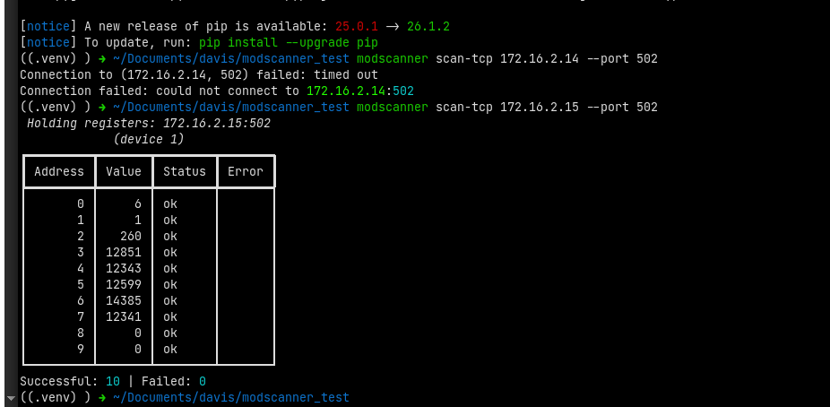

# ModScanner

A safety-first toolkit for discovering, inspecting, scanning, and interacting with Modbus TCP devices.

ModScanner provides a command-line interface and Python API for working with Modbus devices. It supports network discovery, adaptive scanning of Modbus data areas, and controlled write operations for coils and holding registers.

ModScanner helps engineers inspect Modbus devices without immediately falling back to slow, one-register-at-a-time scanning. It reads registers in blocks and adaptively splits rejected blocks to identify valid and invalid addresses.

> **Project status:** 
Early development. The API and CLI may change between releases.

## Features 

- Python API and CLI
- Modbus TCP support
- Network discovery of Modbus devices
- Configurable device ID, port, timeout, address range, and block size
- Adaptive block splitting when a device rejects a register range
- Seperation of protocol errors, transport errors, and invalid responses
- Terminal output using Rich
- Typed Python data module
- Transport abstraction that is built untop of PyModbus
- Unit tested scanning and writing behavior
- Scan all devices on your network that uses Modbus
- Show the slave ID of the Modbus devices
- Type Python models

### Supported Modbus Operations

| Function | Description | Supported |
|---|---|---|
| FC01 | Read Coils | ✅ |
| FC02 | Read Discrete Inputs | ✅ |
| FC03 | Read Holding Registers | ✅ |
| FC04 | Read Input Registers | ✅ |
| FC05 | Write Single Coil | ✅ |
| FC06 | Write Single Holding Register | ✅ |
| FC15 | Write Multiple Coils | ✅ |
| FC16 | Write Multiple Holding Registers | ✅ |

---

## Installation

Install ModScanner from PyPI using either of two(2) methods the below:

1. Using pip:

```bash
pip install modscanner
```

2. Using uv:

```bash
uv add modscanner
```

Verify the installation using:
```bash
modscanner --help
or
modscanner --h
or 
modscanner version
```

> **The above help shows the commands available, while the version shows the current version you have installd on your machine**

# Quick start

There are different ways to use the library;

## Command-Line Usage
ModScanner organizes commands into scanning, writing, and network-discovery operations.

Run:
```bash
modscanner --help
```
to see available commands.

### 1. Scan Modbus Data
Display available scan commands:

```bash
modscanner scan --help
```

### 2. Read Coils - FC01
```bash
modscanner scan coils \
    --host 192.168.1.10 \
    --device-id 1 \
    --start 0 \
    --count 8
```

### 3. Read Discrete Inputs - FC02
```bash
modscanner scan coils \
    --host 192.168.1.10 \
    --device-id 1 \
    --start 0 \
    --count 8
```

### 3. Read Holding Registers - FC03
```bash
modscanner scan holding \
    --host 192.168.1.10 \
    --device-id 1 \
    --start 0 \
    --count 20
```

### 4. Read Input Registers - FC04
```bash
modscanner scan input \
    --host 192.168.1.10 \
    --device-id 1 \
    --start 0 \
    --count 20
```

## TCP Port
modscanner uses the standard Modbus TCP port 502 by default.

For examples:
```bash
modscanner scan holding \
    --host 192.168.1.10 \
    --start 0 \
    --count 20
```

To use another port:

```bash
modscanner scan holding \
    --host 192.168.1.10 \
    --port 8196 \
    --start 0 \
    --count 20
```

## Device ID
The default Modbus device ID is 1.

Specify another device ID with:
```bash
modscanner scan holding \
    --host 192.168.1.10 \
    --device-id 5 \
    --start 0 \
    --count 20
```

## Block Size and Timeout
The scan behavior can be configured:
```bash
modscanner scan holding \
    --host 192.168.1.10 \
    --device-id 1 \
    --start 0 \
    --count 100 \
    --block-size 50 \
    --timeout 2
```

## Writing
> [!WARNING]
> Writing Modbus coils or registers can change equipment state,
configuration, or behavior. Verify the device, address, and value before performing write operations. 

Displat the write commands:
```bash
modscanner write --help
```

### Write a Single Coil - FC05
The CLI uses:
- 1 = ON | True
- 2 = OFF | False

Turn a coil ON:
```bash
modscanner write coil \
    --host 192.168.1.10 \
    --device-id 1 \
    --address 0 \
    --value 1
```

Turn if OFF:
```bash
modscanner write coil \
    --host 192.168.1.10 \
    --device-id 1 \
    --address 0 \
    --value 1
```

## Write Multiple Coils -FC15
```bash
modscanner write coils \
    --host 192.168.1.10 \
    --device-id 1 \
    --address 0 \
    --values 1,0,1,0
```

## Write a Single Holding Register - FC06
```bash
modscanner write register \
    --host 192.168.1.10 \
    --device-id 1 \
    --address 108 \
    --value 100
```

## Write Multiple Holding Registers - FC16
```bash
modscanner write registers \
    --host 192.168.1.10 \
    --device-id 1 \
    --address 200 \
    --values 10,20,30,40
```

---
# Network Discovery
modscanner can search a subnet for devices accepting Modbus TCP connections.

```bash
modscanner scan-network \
    --subnet 192.168.2.0/24
```

Port 502 is used by default.

To scan another Modbus TCP port:
```bash
modscanner scan-network \
    --subnet 192.168.2.0/24 \
    --port 8196
```
---

# Vendor Information
modscanner cnan optionally attempt to identify devices vendors using MAC ADDRESS information.

```bash
modscanner scan-network \
    --subnet 192.168.2.0/24 \
    --show-vendor
```

---
---
# PYTHON API
modscanner can also be used directly as a Python library.

### Create a Target
```python
from modscanner.models import TcpTarget

target = TcpTarget(
    host="192.168.1.10",
    device_id=1,
)
```
Port 502 is used automatically.

TO use another port:
```python
target = TcpTarget(
    host="192.168.1.10",
    port=8196,
    device_id=1,
)
```

### Create a Transport
```python
from modscanner.transports.pymodbus_transport import PymodbusTcpTransport

transport = PymodbusTcpTransport(target)
```
---
## Reading with Python

```python
from modscanner.models import RegisterArea, ScanPlan
from modscanner.scanner import Scanner

scanner = Scanner(
    transport,
    target,
)

plan = ScanPlan(
    area=RegisterArea.HOLDING_REGISTER,
    start=0,
    count=20,
)

transport.connect()

try:
    report = scanner.scan(plan)

    for result in report.results:
        print(
            result.address,
            result.value,
            result.status,
        )

finally:
    transport.close()
```

Scanner methods are also available directly:
```python
scanner.scan_coils(plan)

scanner.scan_discrete_inputs(plan)

scanner.scan_holding_registers(plan)

scanner.scan_input_registers(plan)
```

---
## Writing with Python
The Python API uses native Python booleans for coil values.
```python
from modscanner.writer import Writer

writer = Writer(
    transport,
    target,
)
```

### Write One Coil
```python
transport.connect()

try:
    result = writer.write_coil(
        address=0,
        value=True,
    )

finally:
    transport.close()
```

### Write Multiple Coils
```python
result = writer.write_coils(
    address=0,
    values=(
        True,
        False,
        True,
        False,
    ),
)
```


### Write One Holding Register
```python
result = writer.write_register(
    address=108,
    value=100,
)
```

### Write Multiple Holding Registers
```python
result = writer.write_registers(
    address=200,
    values=(
        10,
        20,
        30,
        40,
    ),
)
```

---
---
# Examples
Examples are available in the [examples](examples) directory.

If the shell scripts were created manually, make them executable:

```bash
chmod +x examples/cli/*.sh
```

THen run an example:
```bash
./examples/cli/scan_holding_registers.sh
```

Python examples can be run using:
```bash
python examples/python/scan_holding_registers.py
```

See [examples/README.md](examples/README.md) for additional examples.

---
---

# Addressing
modscanner uses zero-based Modbus protocol addresses.

Example, a device manual may describe first holding register as:
- 40001

wihile the corresponding Modbus protocol address may be:
- 0

Always confirm the addressing conventions used by the device manufacturer before reading or writing registers.

---
---
# Adaptive Scanning
Some Modbus devices reject an entire request when only part of the requested address range is invalid.

Example:
- Request
    - 0 -------- 19
    - Valid device registers:
        - 8 9 

A normal block request may fail completely because addresses outside the valid
range are unsupported.

ModScanner handles this by:

- Reading a block of addresses.
- Accepting the block when the response succeeds.
- Splitting the block when the device returns a protocol-level error.
- Retrying smaller blocks.
- Continuing until valid and invalid addresses can be identified.
- Avoiding recursive retries when the failure is caused by the network or transport layer.

This allows ModScanner to inspect sparse register maps without immediately
falling back to one request per address.

---
---
# Error Handling
modscanner distinguishes between several classes of failues.

## Protocol Errors
The Modbus device responded but rejected the request.

Examples include:
- Illegal Function
- Illegal Data Address
- Illegal Data Value

## Transport Errors
Communication with the device failed.

Examples include:
- Connection refused
- Connection timeout
- Network unreachable

## Invalid responses
A response was received but did not contain the data expected by modscanner.

Keeping these failure categories seperate allows higher-level tools to respond appropriately.


<!-- Prev Verson -->


<!-- 
### 1. Scan holding registers

1. Quick Scan of 10 registers:

```bash
modscanner scan-tcp 192.168.1.10 --port 502
```

Result:


2. Scan holding registers `0` through `19` on a Modbus TCP device using the below:

```bash
modscanner scan-tcp 192.168.1.10 --device-id 1 --start 0 --count 20
```

> **The above expects you to use the IP Address of the Modbus device, so replace the 192.168.1.10 with your Modbus device**

3. Specify the TCP port, timeout, and request block size using:

```bash
modscanner scan-tcp 192.168.1.10 --port 502 --device-id 1 --start 0 --count 100 --block-size 50 --timeout 2
```

Run:
```bash
modscanner scan-tcp --help
```

to see all available options.

### 2. Show all devices on your network using Modbus including the slave ID

1. Scan all the devices on your network, and display the devices that are running Modbus:

```bash
modscanner scan-network --subnet 192.168.2.0/24
```

The above shows the list of all devices running Modbus. 

> **Note: You can also get the vendor names, so that you can know what Modbus device has what IP Address. To get the vendor names, root privledge is required, run the below code;

```bash
modscanner scan-network --subnet 192.168.2.0/24 --show-vendor
```

> ***After running the above for the first time, you will be prompted to enter your admin password.

Run:
```bash
modscanner scan-network --help
```

to see all available options.

## Addressing

ModScanner uses zero-based Modbus protocol addresses.

For example, a vendor document may label the first holding register as `40001`, while its protocol address is commonly `0`.

Always confirm how the device manufacturer represents register addresses before scanning.

## Adaptive scanning

Some Modbus devices reject an entire request when only one address is within the requested block is invalid.

ModScanner handles this by:
1. Reading a block of registers.
2. Accepting the block when the response is valid.
3. Splitting a block when the device return a protocol-level error.
4. Continuing until individual valid and invalid addresses are identified.
5. Avoiding recursive requests after transport failure such as timeouts.

This reduces unnecessary requests while stil supporting sparse register maps. -->


## Safety

Modbus write operations can control or reconfigure physical equipments like VFDs, inverters, sensors, etc.

Before performing a write:

- confirm the target IP address
- confirm the TCP port
- confirm the device ID
- confirm the address
- confirm that the address is writable
- confirm the permitted value range
- understand the effect of changing the value

Do not experiment with unknown writable addresses on production equipment.

Read operations should also be performed responsibly. Excessive scanning may place unnecessary load on embedded or industrial devices.

## Current limitations

modscanner is still under active development.

Current limitations include

- Modbus RTU is not yet supported
- automatic device ID discovery is not yet implemented
- JSON/CSV/YAML export is not yet implemented
- register data-type decoding is not yet implemented
- byte-order and word-order conversion are not yet implemented
- device profiles are not yet implemented
- continuous register monitoring is not yet implemented
- writable-register allowlists are not yet implemented
- write readback verification is not yet implemented
- write audit logging is not yet implemented

> **All the above are planned for future releasesa**

## Development
Clone the repository and install the development environment:
```bash
git clone https://github.com/davisonyeas/modscanner.git
cd modscanner
uv sync
```

Activate the environment:
```bash
source .venv/bin/activate
```

Run the unit tests:
```bash
pytest tests/unit -v
```

Run all tests:
```bash
pytest
```

Run linting:
```bash
ruff check .
```

Run type checking:
```bash
mypy src
```

## Documentation
Additional documentation and runnable examples are abailable under:
- [docs/](docs/)
- [examples/](examples/)

## Contibuting
Contributions are welcome.

See [CONTRIBUTING.md](CONTRIBUTING.md) for contribution guidelines.

## Package PyPI
modscanner is available on PyPI:

Visit:

[https://pypi.org/project/modscanner/](https://pypi.org/project/modscanner/)

## Security

Do not use ModScanner to perform unauthorized scanning or testing.

## License
See 
[LICENSE](LICENSE)

## Author
Developed by [Davis Onyeoguzoro](https://github.com/davisonyeas)